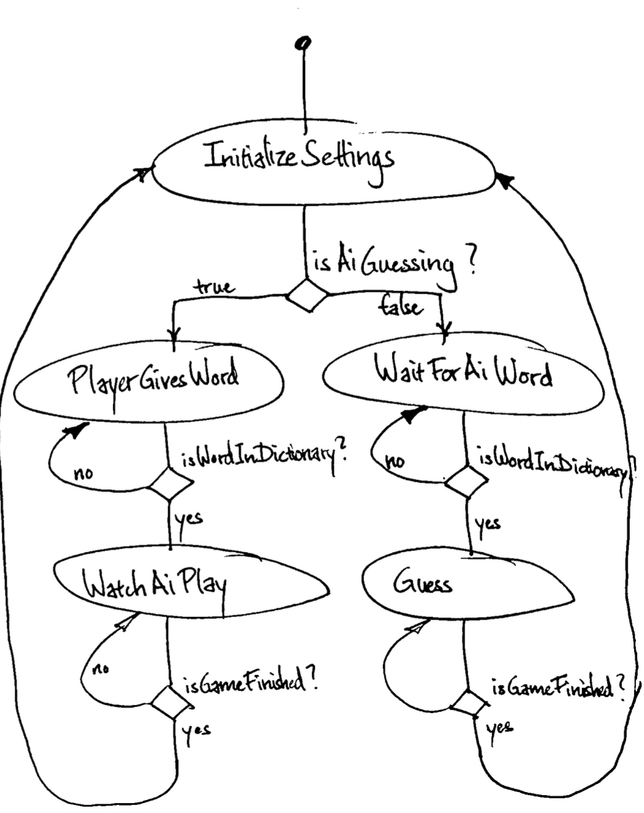
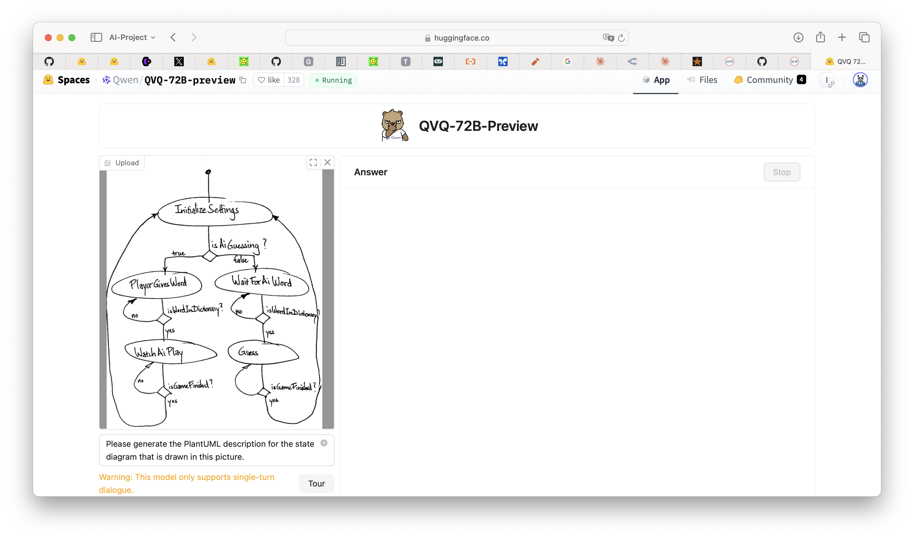
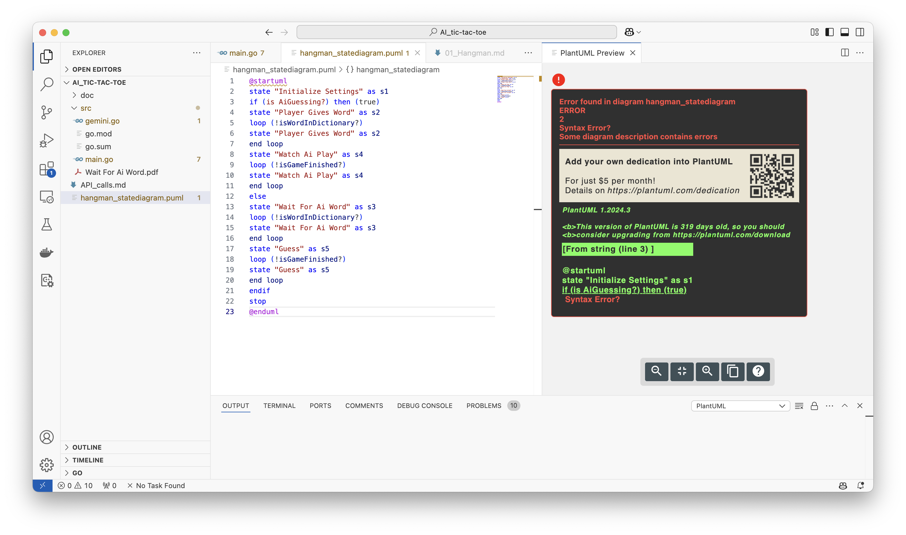
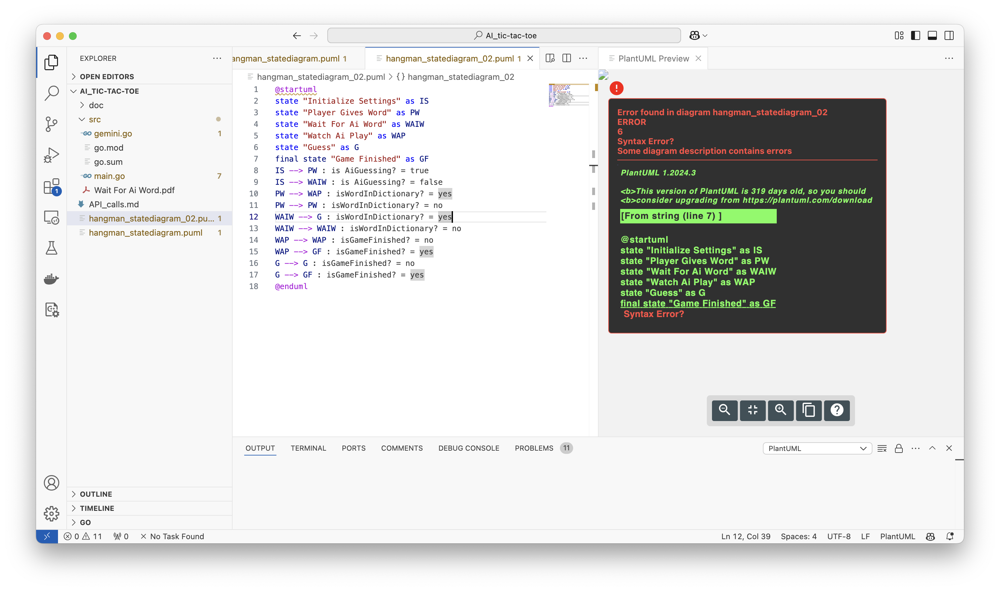
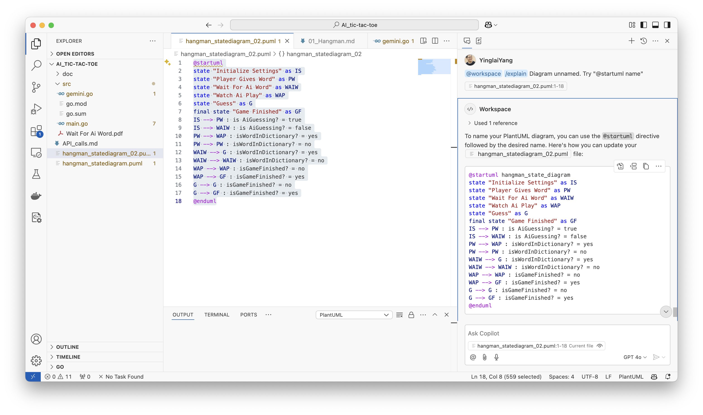
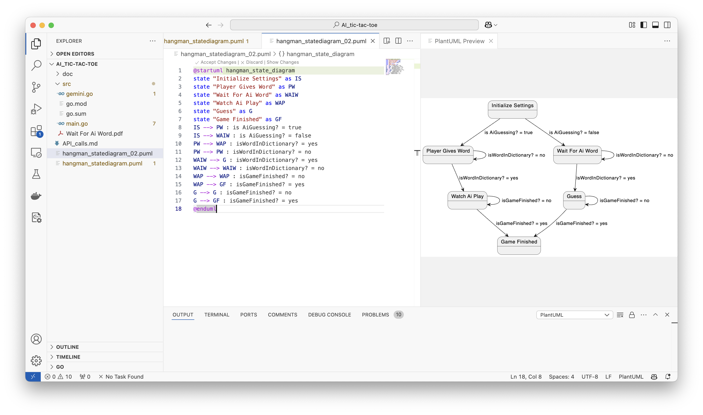
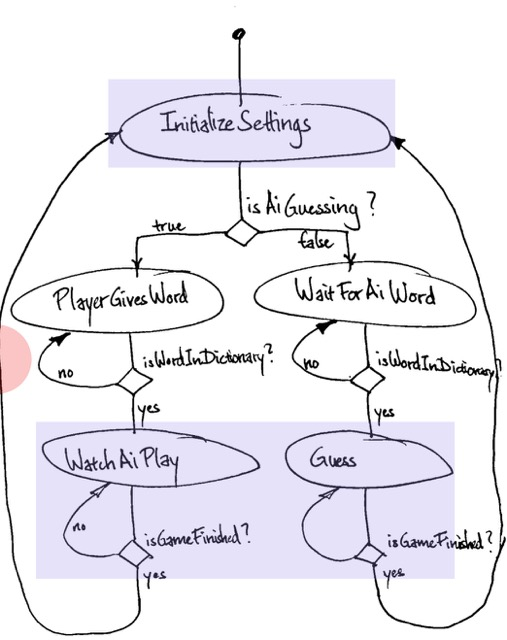
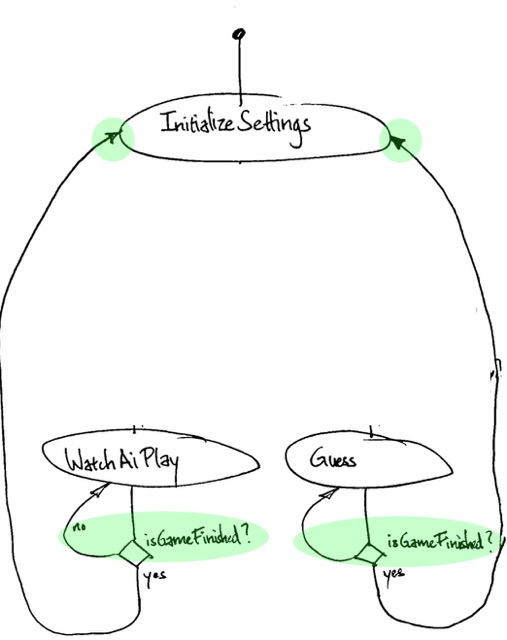

+++
title = "AI-Supported Software Engineering: Generate PlantUML Code from Hand-Drawn State Diagrams."
date = 2025-02-23
draft = false
+++

# Introduction - Expand AI Copilots Beyond Coding
By now, everyone has heard about using LLMs for coding. You can just use a tool like plain VS Code with Github Copilot, Cursor, Windsurf or even just use ChatGPT or Claude and copy-paste code.

But this only covers the part of writing code.

If we look further into software development workflows, it generally involves more than just pushing out code. 

1. You have phases where you try to understand what has to be achieved. This can be done using __formalized requirements__ or __user-stories__. 
    * They make sure that you really understand what should be done, by forcing you and the stakeholders to communicate and align. 
    * Requirements and user-stories also make it easier to onboard others into the development effort - since it will be much easier for them to understand what shall be achieved.  

2. Then you move on to design the "blueprint" of the software which include methods like __state diagrams__[^1], __sequence diagrams__ or __class diagrams__. 
    * These make it easier for you to understand if the software can achieve all of the requirements. 
    * They also allow you to find out if there are some edge-cases you might not have considered before. 
    * Finally, again, such diagrams make it much easier to onboard others into the development effort.

3. Finally, you need formalized testing like __unit-tests__. These are procedures that make sure that your code at least fulfills the intentions captured by the tests. In the long run, executing a full set of formalized tests will make sure that any code change you do, at least does not break previous functionalities.

__What does it all mean in terms of using LLMs in the workflow?__ Does it mean the usage of LLMs will be reduced to toy projects that cannot scale to large complex software?

__I believe that AI-Copilots both benefits from all of the mentioned practices, and make it easier to create the artifacts from these practices!__


# Example Use Case - State Diagrams
_Original date of experiment: 07.01.2025_

## Draft on Paper, Transfer To Code Using VL-Models
State diagrams are something inherently visual. You could use drawing tools like Figma, Mural or Microsoft Visio to create visual state diagrams. While allowing you to work quickly and create state diagrams in an easy way, this has some disadvantages. For example version control is difficult. Also in many cases you would be locked into certain tools.

There is an alternative, which is widely used in some places: PlantUML[^2]

It is "UML-diagrams-as-code", which is perfect for pairing it with LLMs.

There is one pain point though. From my own experience, it is cumbersome to write PlantUML. It takes a lot of time, and is also prone to mistakes. Just small mistakes will lead to the whole diagram not rendering correctly!

It is much easier for me to draw a state diagram by hand. 

How then to transfer the state diagram on paper to the computer? 

__Vision-Language Models__ come to the rescue.

These are a type of LLMs that are extended to parse and understand images.

Below you can find my experiment in accelerating the creation of state diagrams.

## Using QVQ-72B-Preview
I had an actual recent state diagram that I wanted to draft up for a private project ("AI Hangman" - more about it in later posts).

This is the scan using my smartphone of the state diagram that I drew up in my notebook:


I chose Alibaba Qwen's QVQ-72B-Preview model because it is a capable and open source model.

You can find their chat interface here: <https://chat.qwenlm.ai>

If you do not wish to create an account with Qwen, you can also find their models on Huggingface: <https://huggingface.co/Qwen/QVQ-72B-Preview>

### First attempt of getting a PlantUML for my state diagram
#### Prompt
Here is the first attempt with the prompt:
> Please generate the PlantUML description for the state diagram that is drawn in this picture.  



#### Answer
<details>
<summary>Read the full answer from QVQ:</summary>

> So I've got this hand-drawn flowchart, and I need to convert it into a PlantUML state diagram. I'm not super familiar with PlantUML syntax, but I'll try to figure it out step by step.
>
> First, I need to understand the flow of the program from the diagram. It starts with "Initialize Settings," and then there's a decision point: "is AiGuessing?" Depending on whether it's true or false, it goes down different paths.
>
> If "is AiGuessing?" is true, it goes to "Player Gives Word," and then checks if the word is in the dictionary. If not, it loops back to "Player Gives Word." If it is in the dictionary, it moves to "Watch Ai Play," and then checks if the game is finished. If not, it loops back to "Watch Ai Play"; if yes, it ends.
>
> If "is AiGuessing?" is false, it goes to "Wait For Ai Word," then checks if the word is in the dictionary. If not, it loops back to "Wait For Ai Word." If yes, it moves to "Guess," then checks if the game is finished. If not, it loops back to "Guess"; if yes, it ends.
>
> Alright, so in terms of states, I have:
> 1. Initialize Settings
> 2. Player Gives Word
> 3. Wait For Ai Word
> 4. Watch Ai Play
> 5. Guess
>
> And decision points:
> * is AiGuessing?
> * isWordInDictionary? (for both player and AI)
> * isGameFinished? (for both paths)
>
> In PlantUML, states are usually represented with rounded rectangles, and decisions are diamonds with questions inside. Arrows show the flow between these elements.
>
> I think I need to use the state keyword for states and if for decisions.
> Let me start writing the PlantUML code.
> I'll begin with the initial state:
> state "Initialize Settings" as s1
>
> Then, there's a decision: "is AiGuessing?"
> I can represent this with an if statement.
> From there, if "is AiGuessing?" is true, it goes to "Player Gives Word," otherwise to "Wait For Ai Word."
>
> So:
> `if (is AiGuessing?) then (true)
> state "Player Gives Word" as s2
> else (false)
> state "Wait For Ai Word" as s3
> endif`
>
> Now, for "Player Gives Word," there's a check: "isWordInDictionary?"
> If no, loop back to "Player Gives Word"; if yes, go to "Watch Ai Play."
>
> Similarly, for "Wait For Ai Word," there's the same check: "isWordInDictionary?"
> If no, loop back; if yes, go to "Guess."
>
> Then, from "Watch Ai Play," check "isGameFinished?"
> If no, loop back; if yes, end.
>
> From "Guess," check "isGameFinished?"
> If no, loop back; if yes, end.
>
> Also, there's a start and end point.
> I need to make sure the flow starts from "Initialize Settings" and ends properly.
>
> Let me try to sketch this out.
> Start
> -> s1: Initialize Settings
> if (is AiGuessing?)
> then (true)
> -> s2: Player Gives Word
> while (!isWordInDictionary?)
> -> s2: Player Gives Word
> end while
> -> s4: Watch Ai Play
> while (!isGameFinished?)
> -> s4: Watch Ai Play
> end while
> else (false)
> -> s3: Wait For Ai Word
> while (!isWordInDictionary?)
> -> s3: Wait For Ai Word
> end while
> -> s5: Guess
> while (!isGameFinished?)
> -> s5: Guess
> end while
> endif
> End
>
> I think this captures the flow.
> Now, to translate this into PlantUML syntax.
> I'll use the state keyword for states, if for decisions, and while for loops.
>
> Here's my attempt:
> ```plantuml
> @startuml
> state "Initialize Settings" as s1
> if (is AiGuessing?) then (true)
> state "Player Gives Word" as s2
> while (!isWordInDictionary?)
> state "Player Gives Word" as s2
> end while
> state "Watch Ai Play" as s4
> while (!isGameFinished?)
> state "Watch Ai Play" as s4
> end while
> else
> state "Wait For Ai Word" as s3
> while (!isWordInDictionary?)
> state "Wait For Ai Word" as s3
> end while
> state "Guess" as s5
> while (!isGameFinished?)
> state "Guess" as s5
> end while
> endif
> stop
> @enduml
> ```
>
> I think this should work. I might need to adjust the syntax a bit, but this is a good starting point.
> Wait, in PlantUML, the while loop is usually represented inside a state, but I'm not sure if it's exactly like this. Maybe I should use loop instead.
>
> Let me check the PlantUML documentation.
> Okay, according to the docs, you can use loop inside a state to represent loops.
> So, perhaps it's better to use loop instead of while.
> Also, in PlantUML, the if statement should be followed by then and else, and ended with endif.
>
> I think my previous syntax is close, but maybe I need to adjust the loop representation.
> Let me try again:
> ```plantuml
> @startuml
> state "Initialize Settings" as s1
> if (is AiGuessing?) then (true)
> state "Player Gives Word" as s2
> loop (!isWordInDictionary?)
> state "Player Gives Word" as s2
> end loop
> state "Watch Ai Play" as s4
> loop (!isGameFinished?)
> state "Watch Ai Play" as s4 
> end loop 
> else 
> state "Wait For Ai Word" as s3
> loop (!isWordInDictionary?)
> state "Wait For Ai Word" as s3
> end loop 
> state "Guess" as s5 
> end loop 
> endif 
> stop 
> @enduml
> ```
</details>

#### Compiled Result


Hmmm. Does not look very good. So what is wrong?

I notice that it does not draw arrows between the states, but rather implements if/else clauses and loops. I will try to correct it by giving QVQ this information.

### Second try with additional context
#### Prompt
> Please generate the PlantUML description for the state diagram that is drawn in this picture.  
> 
> There are only one-directional transitions going between states and sometimes conditionals.  
> 
> There are some conditionals that result in the outgoing state being revisited - meaning that the state transitions into itself under certain conditions.

#### Answer
> ```plantuml
> @startuml
> state "Initialize Settings" as IS
> state "Player Gives Word" as PW
> state "Wait For Ai Word" as WAIW
> state "Watch Ai Play" as WAP
> state "Guess" as G
> final state "Game Finished" as GF
> IS --> PW : is AiGuessing? = true
> IS --> WAIW : is AiGuessing? = false
> PW --> WAP : isWordInDictionary? = yes
> PW --> PW : isWordInDictionary? = no
> WAIW --> G : isWordInDictionary? = yes
> WAIW --> WAIW : isWordInDictionary? = no
> WAP --> WAP : isGameFinished? = no
> WAP --> GF : isGameFinished? = yes
> G --> G : isGameFinished? = no
> G --> GF : isGameFinished? = yes
> @enduml
> ```

#### Compiled Result

As you can see, there are still bugs in it.

### Fixing the "mess"
I try to get Github Copilot to fix it, to test how capable that is. It does not find the syntax error given by the PlantUML Preview.


Eventually, I did a small manual fix: I removed the „final“ in line 7. Now it gives an actual state diagram.


If you remember the original drawing of the state diagram, the idea is that after each finished game of Hangman, the program loops back to the settings so that you can play a new game.
But the state diagram that Qwen created ends in a new state named "Game Finished".

# Verdict
* __There is a lot of potential__ for using multimodal models to transfer visual UML diagrams into computer readable description files.
* __General multimodal model like Qwen QVQ already show a lot of promise.__ Despite PlantUML being a niche description language! This means for PlantUML there might not even be a need for fine-tuning.
* __But it does not quite work yet. I hypothesize the image understanding part needs to be improved the most__ for this particular use-case. The language part that generates the PlantUML code is almost there.

What might be difficult for the image understanding part:
1. It needs help to understand with what vocabulary to parse and describe a state diagram. 
   * The first PlantUML that was generated tried to introduce "loops". The transitions that keep the same state as the next state do look like 🔄. 
   * This is a hint that the image understanding of QVQ was trying to parse the image with more general vocabulary like "loop".
   * This would also explain why QVQ became a lot better when it was told that the image only contains one-directional transitions going between states, which focuses the vocabulary of the image understanding into "transitions" and "states".

2. It seems to have difficulties in following arrows over long distances.
   * See the purple boxes in the first image below. The outgoing and ingoing states are relatively far away from each other. Closeness in position might correlate in a way with how much the image understanding will create relationships between two sections in the image.
   * See the red marking in the first image below. The arrow on the left is a bit broken-up. This is an artifact from the scanning process with my phone. However it is unlikely to be a big factor for the failing, since the right arrow is complete. Still QVQ was not able to follow it.
   * See the green markings in the second image below. The arrow markings which point out that the lines are arrows, not just any line, are far away from the outgoing state that they are connected to. Maybe it would make it easier for QVQ to tell that it needs to follow the whole lines to connect with something by adding an arrow marking close to the decision behind the outgoing state.

I will try out some experiments in the future to see if I can support the hypotheses here.

<div style="text-align: center">




</div>


---
__Footnotes__  

[^1]: https://en.wikipedia.org/wiki/State_diagram  

[^2]: https://plantuml.com/de/